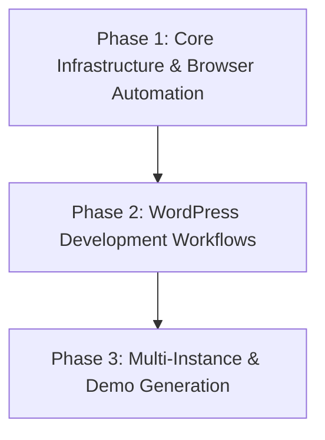

# Project Roadmap: Docker WordPress Development Environment

**Last Updated**: 2025-01-26

## 1. Overall Project Vision & Goals
*   Create containerized WordPress development environment with semantic search capabilities
*   Integrate Disney-themed property search UI with AI-powered semantic search API
*   Support multiple simultaneous WordPress instances for portfolio/client work
*   Provide consistent, repeatable development experience with magical user interfaces

## 2. Major Project Phases / Epics

### ✅ Phase 1: Semantic Search System Restoration - COMPLETE
*   **Description**: Restore and verify semantic search functionality with complete embeddings
*   **Status**: ✅ COMPLETE (Major Critical Issue Resolved)
*   **Key Objectives**: ✅ ALL COMPLETED
    *   ✅ Diagnosed and fixed empty embeddings file (0 → 458 properties)
    *   ✅ Generated complete Gemini API embeddings (196 bytes → 8.8MB)
    *   ✅ Restored semantic similarity search with real scoring
    *   ✅ Verified search quality with test queries (39.6-64.8% similarity scores)
*   **Primary Achievement**: Critical search system fully operational

### 🔄 Phase 2: Disney Cottage UI Integration - 75% COMPLETE
*   **Description**: Create magical Disney-themed property search interface with API integration
*   **Status**: 🔄 IN PROGRESS (6/8 Success Criteria Complete)
*   **Key Objectives**: 
    *   ✅ Built complete Disney cottage search UI with magical theming
    *   ✅ Implemented real-time semantic search with API integration
    *   ✅ Added property cards with similarity scores and modal details
    *   ✅ Created responsive design with advanced filters
    *   ✅ Built demo interface with API status monitoring
    *   ✅ Verified end-to-end user journey functionality
    *   🔄 **PENDING**: Performance optimization (sub-2 second responses)
    *   🔄 **PENDING**: Complete documentation and mobile testing
*   **Current Branch**: `feature/disney-cottage-ui-integration`

### Phase 3: WordPress Development Workflows
*   **Key Objectives**:
    *   WordPress container deployment and database integration
    *   Browser MCP server installation and configuration
    *   WordPress installation automation via browser interaction
    *   Basic development workflow validation
*   **Primary HDTA Links**: 
    *   `memory-bank/docker_infrastructure_module.md`
    *   `memory-bank/browser_automation_module.md`
    *   `memory-bank/implementation_plan_wordpress_automation.md`
*   **Notes/Key Deliverables**:
    *   Working WordPress at localhost:8090
    *   Browser MCP automation of WordPress setup
    *   Documentation of browser automation capabilities

### Phase 2: WordPress Development Workflows
*   **Description**: AI-assisted theme and plugin development with automated testing
*   **Status**: Planned
*   **Key Objectives**:
    *   Custom theme development templates and scaffolding
    *   Plugin development automation and testing
    *   Claude Code integration for WordPress-specific development
    *   Code quality validation and best practices enforcement
*   **Primary HDTA Links**:
    *   `memory-bank/wordpress_development_module.md`
    *   `memory-bank/implementation_plan_theme_development.md`
*   **Notes/Key Deliverables**:
    *   WordPress development prompt library
    *   Automated theme/plugin generation
    *   Quality assurance automation

### Phase 3: Multi-Instance & Demo Generation
*   **Description**: Multiple WordPress instances and automated demo site creation
*   **Status**: Planned
*   **Key Objectives**:
    *   Port-based multi-instance deployment
    *   Automated demo content generation
    *   Portfolio project management workflows
    *   Client presentation and handoff automation
*   **Primary HDTA Links**:
    *   `memory-bank/multi_instance_module.md`
*   **Notes/Key Deliverables**:
    *   Multi-instance management scripts
    *   Demo site generation automation
    *   Client handoff documentation

## 3. High-Level Inter-Phase Dependencies

## 4. Key Project-Wide Milestones
*   **Browser Automation MVP**: WordPress installation automated via Browser MCP - Status: In Progress (Current Session)
*   **Development Workflow Complete**: AI-assisted theme/plugin development operational - Status: Planned
*   **Multi-Instance Deployment**: Multiple WordPress instances running simultaneously - Status: Planned
*   **First Demo Site**: Complete WordPress site built with full automation - Status: Planned

## 5. Overall Project Notes / Strategic Considerations
*   Focus on rapid prototyping and demo creation rather than production deployment
*   Prioritize ease of use and automation over advanced security features
*   Design for scalability to multiple instances without resource conflicts
*   Leverage Browser MCP for realistic testing and validation workflows