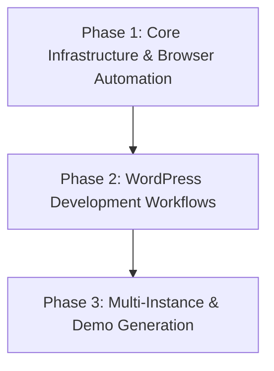

# Project Roadmap: Docker WordPress Development Environment

**Last Updated**: 2025-01-06

## 1. Overall Project Vision & Goals
*   Create containerized WordPress development environment with semantic search capabilities
*   Integrate Disney-themed property search UI with AI-powered semantic search API (✅ LIVE)
*   Support multiple simultaneous WordPress instances for portfolio/client work
*   Provide consistent, repeatable development experience with magical user interfaces

## 2. Major Project Phases / Epics

### ✅ Phase 1: React Component Migration Foundation - COMPLETE
*   **Description**: Establish React TypeScript component library for headless WordPress architecture
*   **Status**: ✅ COMPLETE (PR Review Lifecycle Successfully Completed)
*   **Key Objectives**: ✅ ALL COMPLETED
    *   ✅ Built complete React component library with TypeScript interfaces
    *   ✅ Implemented Disney theming with magical animations and styling
    *   ✅ Created custom hooks for state management and API patterns
    *   ✅ Resolved all codeRABBIT review issues (13→0 actionable comments)
    *   ✅ Achieved strategic coordination with production infrastructure
    *   ✅ Established headless WordPress architecture foundation
*   **Primary Achievement**: React foundation ready for WordPress API integration

### 🔄 Phase 2: WordPress API Integration - PLANNED
*   **Description**: Connect React components to WordPress REST API for headless architecture
*   **Status**: 🔄 READY TO START (React foundation complete)
*   **Key Objectives**: 
    *   🔄 **NEXT**: Implement WordPress REST API integration patterns
    *   🔄 **NEXT**: Connect React components to WordPress content management
    *   🔄 **NEXT**: Add SWR caching and performance optimization
    *   🔄 **NEXT**: Configure Next.js production build with Docker infrastructure
    *   🔄 **NEXT**: Implement full-stack error handling and validation
    *   🔄 **NEXT**: Add comprehensive testing for React + WordPress integration
    *   🔄 **NEXT**: Performance optimization (sub-2 second API responses)
    *   🔄 **NEXT**: Complete integration documentation and deployment guide
*   **Prerequisites**: ✅ React foundation complete from Phase 1

### Phase 3: Production Deployment & Optimization - PLANNED
*   **Description**: Deploy headless WordPress + React architecture to production
*   **Status**: PLANNED (Infrastructure foundation ready)
*   **Key Objectives**:
    *   Production Docker configuration with SSL/TLS and Redis
    *   Next.js static generation and CDN optimization
    *   WordPress performance tuning and caching strategies
    *   Full-stack monitoring and error tracking
    *   Automated CI/CD pipeline for React + WordPress deployments
*   **Prerequisites**: WordPress API integration complete from Phase 2
*   **Primary HDTA Links**: 
    *   `docker-compose.production.yml` (ready)
    *   `PRODUCTION-DEPLOYMENT.md` (comprehensive guide)
*   **Notes/Key Deliverables**:
    *   Production-ready headless WordPress architecture
    *   React frontend with optimized performance
    *   Comprehensive monitoring and analytics

### Phase 2: WordPress Development Workflows
*   **Description**: AI-assisted theme and plugin development with automated testing
*   **Status**: Planned
*   **Key Objectives**:
    *   Custom theme development templates and scaffolding
    *   Plugin development automation and testing
    *   Claude Code integration for WordPress-specific development
    *   Code quality validation and best practices enforcement
*   **Primary HDTA Links**:
    *   `memory-bank/wordpress_development_module.md`
    *   `memory-bank/implementation_plan_theme_development.md`
*   **Notes/Key Deliverables**:
    *   WordPress development prompt library
    *   Automated theme/plugin generation
    *   Quality assurance automation

### Phase 3: Multi-Instance & Demo Generation
*   **Description**: Multiple WordPress instances and automated demo site creation
*   **Status**: Planned
*   **Key Objectives**:
    *   Port-based multi-instance deployment
    *   Automated demo content generation
    *   Portfolio project management workflows
    *   Client presentation and handoff automation
*   **Primary HDTA Links**:
    *   `memory-bank/multi_instance_module.md`
*   **Notes/Key Deliverables**:
    *   Multi-instance management scripts
    *   Demo site generation automation
    *   Client handoff documentation

## 3. High-Level Inter-Phase Dependencies

## 4. Key Project-Wide Milestones
*   **Browser Automation MVP**: WordPress installation automated via Browser MCP - Status: In Progress (Current Session)
*   **Development Workflow Complete**: AI-assisted theme/plugin development operational - Status: Planned
*   **Multi-Instance Deployment**: Multiple WordPress instances running simultaneously - Status: Planned
*   **First Demo Site**: Complete WordPress site built with full automation - Status: Planned

## 5. Overall Project Notes / Strategic Considerations
*   Focus on rapid prototyping and demo creation rather than production deployment
*   Prioritize ease of use and automation over advanced security features
*   Design for scalability to multiple instances without resource conflicts
*   Leverage Browser MCP for realistic testing and validation workflows