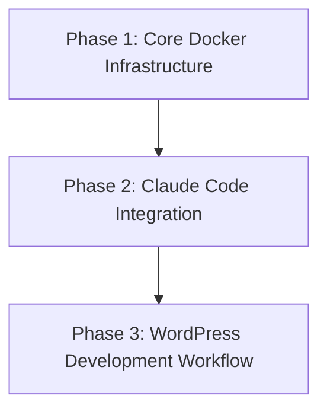

# Project Roadmap: Docker WordPress Development Environment

**Last Updated**: 2024-12-28 (Sync Update)

## 1. Overall Project Vision & Goals
*   Create containerized WordPress development environment for rapid prototyping and demos
*   Integrate Claude Code for AI-assisted development within containerized environment
*   Support multiple simultaneous WordPress instances for portfolio/client work
*   Provide consistent development experience across different machines

## 2. Major Project Phases / Epics

### Phase 1: Core Docker Infrastructure
*   **Description**: Basic Docker setup with WordPress, MySQL, and VS Code browser interface
*   **Status**: In Progress (Setup and Planning Complete)
*   **Key Objectives**:
    *   Multi-container orchestration with docker-compose
    *   Dynamic port allocation for multiple instances
    *   Persistent data storage and volume management
*   **Primary HDTA Links**: 
    *   `memory-bank/docker_setup_module.md`
    *   `memory-bank/implementation_plan_docker_setup.md`
*   **Notes/Key Deliverables**:
    *   Working docker-compose.yml configuration
    *   Setup scripts for environment initialization

### Phase 2: Claude Code Integration
*   **Description**: Integrate Claude Code within containerized environment with MCP servers
*   **Status**: Planned  
*   **Key Objectives**:
    *   Claude Code setup within container
    *   MCP server integration (Bright Data, Context 7)
    *   WordPress-specific prompt templates
*   **Primary HDTA Links**:
    *   `memory-bank/claude_integration_module.md`
*   **Notes/Key Deliverables**:
    *   Configured .claude.json and CLAUDE.md files
    *   MCP installation scripts

### Phase 3: WordPress Development Workflow
*   **Description**: Streamlined WordPress development with AI assistance
*   **Status**: Planned
*   **Key Objectives**:
    *   WordPress theme and plugin development templates
    *   Demo site creation workflows
    *   Portfolio project management
*   **Primary HDTA Links**:
    *   `memory-bank/development_workflow_module.md`
*   **Notes/Key Deliverables**:
    *   WordPress development prompt library
    *   Demo site generation scripts

## 3. High-Level Inter-Phase Dependencies

## 4. Key Project-Wide Milestones
*   **Docker Environment MVP**: Basic WordPress + VS Code containers running - Status: Planned
*   **Claude Integration Complete**: AI assistance working within container - Status: Planned  
*   **First Demo Site**: Complete WordPress site built with AI assistance - Status: Planned

## 5. Overall Project Notes / Strategic Considerations
*   Focus on rapid prototyping and demo creation rather than production deployment
*   Prioritize ease of use over advanced security features for personal/demo use
*   Design for scalability to multiple simultaneous instances without resource conflicts