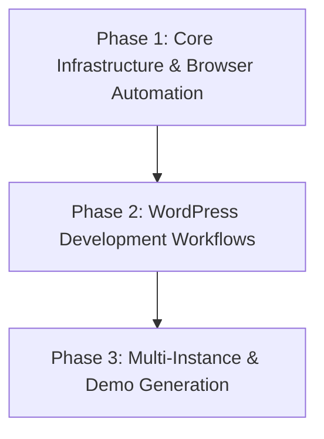

# Project Roadmap: Docker WordPress Development Environment

**Last Updated**: 2025-01-25

## 1. Overall Project Vision & Goals
*   Create containerized WordPress development environment for rapid prototyping and demos
*   Integrate Claude Code with browser automation for AI-assisted WordPress development
*   Support multiple simultaneous WordPress instances for portfolio/client work
*   Provide consistent, repeatable development experience across different machines

## 2. Major Project Phases / Epics

### ✅ Phase 1: WordPress Automation Navigation System - COMPLETE
*   **Description**: Comprehensive WordPress automation infrastructure with complete navigation system
*   **Status**: ✅ COMPLETE (Major Milestone Achieved)
*   **Key Objectives**: ✅ ALL COMPLETED
    *   ✅ WordPress container deployment and database integration
    *   ✅ Browser MCP server installation and configuration
    *   ✅ Comprehensive automation script library development
    *   ✅ Memory bank documentation architecture establishment
    *   ✅ Development workflow compliance enforcement
*   **Primary HDTA Links**: ✅ ALL IMPLEMENTED
    *   `memory-bank/docker_infrastructure_module.md`
    *   `memory-bank/browser_automation_module.md`
    *   `memory-bank/wordpress_development_module.md`
    *   `memory-bank/implementation_plan_wordpress_automation.md`
*   **Deliverables**: ✅ ALL DELIVERED
    *   ✅ Working WordPress at localhost:8090 with complete automation system
    *   ✅ Comprehensive PHP automation script library (page creation, content management)
    *   ✅ Complete memory bank documentation architecture
    *   ✅ Development workflow compliance with proper Git procedures
    *   ✅ Foundation for advanced WordPress automation capabilities

### Phase 2: Browser MCP Integration & Advanced Development Workflows
*   **Description**: Browser MCP testing and AI-assisted theme/plugin development
*   **Status**: Ready to Begin (Current Phase)
*   **Key Objectives**:
    *   Custom theme development templates and scaffolding
    *   Plugin development automation and testing
    *   Claude Code integration for WordPress-specific development
    *   Code quality validation and best practices enforcement
*   **Primary HDTA Links**:
    *   `memory-bank/wordpress_development_module.md`
    *   `memory-bank/implementation_plan_theme_development.md`
*   **Notes/Key Deliverables**:
    *   WordPress development prompt library
    *   Automated theme/plugin generation
    *   Quality assurance automation

### Phase 3: Multi-Instance & Demo Generation
*   **Description**: Multiple WordPress instances and automated demo site creation
*   **Status**: Planned
*   **Key Objectives**:
    *   Port-based multi-instance deployment
    *   Automated demo content generation
    *   Portfolio project management workflows
    *   Client presentation and handoff automation
*   **Primary HDTA Links**:
    *   `memory-bank/multi_instance_module.md`
*   **Notes/Key Deliverables**:
    *   Multi-instance management scripts
    *   Demo site generation automation
    *   Client handoff documentation

## 3. High-Level Inter-Phase Dependencies

## 4. Key Project-Wide Milestones
*   **✅ WordPress Automation Navigation System**: Complete automation infrastructure with PHP script library - Status: ✅ COMPLETE
*   **Browser MCP Integration Testing**: WordPress admin automation validation - Status: Ready to Begin
*   **Development Workflow Complete**: AI-assisted theme/plugin development operational - Status: Planned
*   **Multi-Instance Deployment**: Multiple WordPress instances running simultaneously - Status: Planned
*   **First Demo Site**: Complete WordPress site built with full automation - Status: Ready for Implementation

## 5. Overall Project Notes / Strategic Considerations
*   Focus on rapid prototyping and demo creation rather than production deployment
*   Prioritize ease of use and automation over advanced security features
*   Design for scalability to multiple instances without resource conflicts
*   Leverage Browser MCP for realistic testing and validation workflows